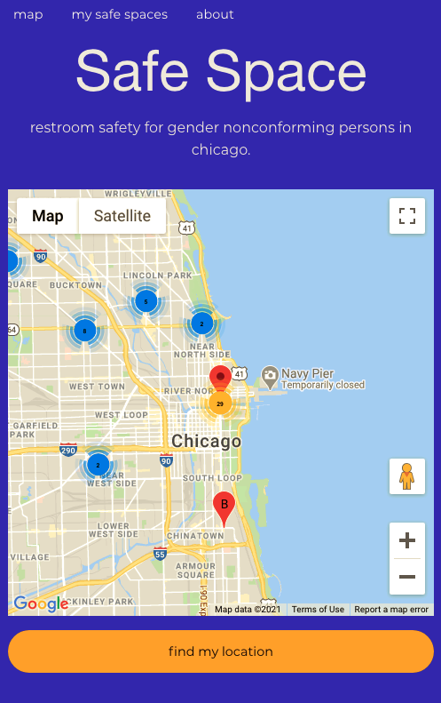

# Chicago Safe Bathroom Locator app

# Concept

Create a user friendly application for gender nonconforming           individuals both, living in and visiting the city of Chicago to help finding a safe restroom.

# Data

We are using Refuge Restroom's current api which can be accessed here:

https://www.refugerestrooms.org/api/docs/

If you would like to contribute safe spaces and locations that aren't on the map please click this link below, all help is important!

https://www.refugerestrooms.org/restrooms/new

## User story

*	I am a citizen/visitor of the city of Chicago and a member of the gender nonconforming comunity.
*	I need to (go).
*	I open the Safe Bathroom Locator app and I am presented with opening page.
*	When I click on find my location the map centers to my location and is propagated with safe bathroom markers that are close to me.
*	When I click on the marker of my choice I am presented with the name, address and a save option for that safe		 bathroom marker.
*	If I choose to save that marker it is saved to My Safe Spaces.
*	As a return user I can click on the My Safe Spaces button in the top nav-bar.

## Sources/Code 

    Zurb Foundation framework
	html/javascript/css/scss
	Google maps api
	Refuge restrooms api

## contributors	

		Zane Gilfillan   
		Kevin Jun  
		Chris Kennedy 
		Dennis Irvin 

